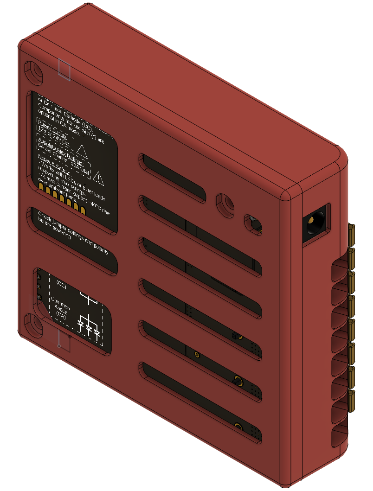

# 5-Channel HomeKit Controller (ESP32-C3) 🏠
An open-source DIY controller powered by ESP32-C3 XIAO with HomeKit compatibility, designed for controling  LED strips and DC devices. Perfect for smart home projects! ✨

## Project Structure 📁
This project consists of three main components:
- `hardware/`: Schematics, PCB files, and BOM (Autodesk Fusion exports)
- `firmware/`: Source code for the ESP32-C3
- `enclosure/`: 3D model files for printing the enclosure

## Hardware Design 🛠️
This open-source project centers around a 5-channel controller based on the ESP32-C3 XIAO microcontroller, designed to be compatible with Apple HomeKit through the HomeSpan library. The hardware has been designed using Autodesk Fusion and is capable of controlling various 12/24V DC devices based on PWM signal. The controller can be used to drive a variety of devices, including:
- LED strips (RGB, RGBW, RGBWC)
- Small DC motors
- Similar DC-powered devices
- Etc.

The PCB features robust power handling capabilities, with each channel capable of delivering 6A (20A max total across all channels). At maximum power (~500W at 24V), expect a temperature rise of up to 40°C above ambient.

Key specifications:
- 5 independent control channels
- 12/24V DC input voltage
- HomeKit compatibility via ESP32-C3 XIAO
- Up to 6A per channel (20A total)
- Dual power input options: DC jack or terminal blocks
- Support for both common anode and common cathode configurations

Power can be supplied through either the DC jack or terminal block connections. The board provides 5 independent output channels (CH1-CH5) through terminal blocks.

<table>
  <tr>
    <td></td>
    <td></td>
    <td></td>
  </tr>
  <tr>
    <td align="center">PCB Top</td>
    <td align="center">PCB Top + Bottom</td>
    <td align="center">PCB Bottom</td>
  </tr>
</table>
<table>
  <tr>
    <td></td>
    <td></td>
  </tr>
  <tr>
    <td align="center">Produced PCB Top</td>
    <td align="center">Produced PCB Bottom</td>
  </tr>
</table>

### Understanding Common Anode vs Common Cathode 💡

The board supports two operating modes, with Common Anode being the recommended choice for most applications:

**Common Anode Mode (Recommended):**
This simpler configuration uses a shared positive (+) connection and N-channel MOSFETs for direct control of each channel. The MOSFETs act as low-side switches, sinking current to the lower rail (ground). Think of it as controlling the negative side while all positives are connected together. This is the default and most common configuration for RGB LED strips and similar devices, requiring fewer components on the PCB.

Technical implementation: The microcontroller drives N-channel MOSFETs that directly control the LED strips channel by connecting them to ground when activated.

**Common Cathode Mode:**
Some specialized LED strips or devices require this mode, where all negatives (-) are connected together. It uses a more complex arrangement with both N-channel and P-channel MOSFETs. The P-MOSFETs act as high-side switches, sourcing current from the upper rail (V+). Components marked with * on the PCB are only needed for this configuration.

Technical implementation: The microcontroller drives N-channel MOSFETs on the lower rail, which in turn control P-channel MOSFETs that source current from the power supply to the LED strips.

Choose Common Anode unless your specific device requires Common Cathode configuration. When in doubt, check your LED strip or device documentation - most standard RGB LED strips use Common Anode.

### Component Options

Several components on the board are optional depending on your needs:
- Common Cathod mode components (marked by *)
- Capacitors C1-C6: Install only if you notice LED flickering or need to filter out the PWM current outpur
- Indicator LEDs (and related resistors): Useful for debugging
- External antenna: XIAO C3 is shipped with an external patch antenna, but the proposed enclosure include a hole to fit better antennas for increased WiFi reception

### Enclosure 🏗️
The provided STL files allow you to 3D print a custom enclosure for the controller. It's designed to be secured with M3 screws and includes a dedicated hole for an optional external antenna.

<table>
  <tr>
    <td></td>
    <td></td>
    <td></td>
  </tr>
  <tr>
    <td align="center"></td>
    <td align="center">Enclosure</td>
    <td align="center"></td>
  </tr>
</table>

You can view the 3D models directly:
- [Top Shell](enclosure/3D_printing/upper_part.stl)
- [Bottom Shell](enclosure/3D_printing/lower_part.stl)

## Setup Guide 🚀

### Hardware Assembly
Begin by choosing your operating mode (CA/CC) based on your device requirements. Assemble the PCB with the appropriate components.

### Firmware Installation
Connect the device to your computer and follow these steps:

1. Enter bootloader mode: Press BOOT, Press RESET, Release RESET, Release BOOT
2. Configure your (Arduino) IDE with:
- Programmer: esptool
- Board: XIAO_ESP32C3
- Appropriate USB port

Modify the XIAO_ESP32C3.ino file according to your setup (RGB or single LED (provided) - or custom) and upload it to the device.

### HomeKit Configuration
The device creates a "homespan-setup" access point for initial configuration. Connect to it and use the configuration portal to set up your WiFi network and create a device setup code. Once configured, add the device to your Apple Home app using this code.

### Troubleshooting 🔧

**Important Switch Configuration:**
The board features a bypass switch (SW1) that serves as a safety and debug feature. When enabled, it bypasses the microcontroller and sets all outputs to maximum power - useful for testing but prevents normal HomeKit control. Ensure this switch is in the correct position for your intended use:
- Normal operation: Switch OFF (microcontroller controls outputs)
- Bypass mode: Switch ON (all outputs at full power)

**Common Issues:**
If your device isn't responding as expected:
1. Check SW1 switch position (should be OFF for normal operation)
2. Verify the indicator LEDs for channel activity

**Factory Reset:**
If you've previously installed HomeSpan devices, you might need to reset this one before configuration. To do so:
1. Connect to your computer via USB
2. Open Serial Monitor (set line ending to "newline")
3. Send the 'E' command to erase all settings
4. Re-upload the firmware
5. Reconfigure HomeKit settings

For advanced HomeSpan-related troubleshooting options, check the [HomeSpan CLI commands](https://github.com/HomeSpan/HomeSpan/blob/master/docs/CLI.md).

## Safety Notice ⚠️

At maximum rating, this device handles significant power levels. Always:
- Verify power supply ratings
- Check all connections before powering up
- Monitor temperature during initial testing
- Follow proper electrical safety practices

**Disclaimer:** This is an open-source DIY project - the creators and contributors:
- Accept no responsibility for any damage or injury that may result from building or using this device
- Make no guarantees about the device's performance or reliability
- Provide this design "as is" without warranty of any kind

By building and/or using this device, you acknowledge these risks and assume full responsibility for implementing and using the design safely. 

Remember: Incorrect assembly or usage could result in fire, damage to connected devices, or other hazards. When in doubt, seek expert advice!

## Acknowledgments & License 📝

Built with [HomeSpan](https://github.com/HomeSpan/HomeSpan) by Gregg E. Berman.
Both this project and HomeSpan are licensed under the [MIT License](LICENSE).

## Need Help? 🤔
Check the troubleshooting section or raise an issue on GitHub. Happy building! 

Copyright (c) 2023 Guillaume Larue
